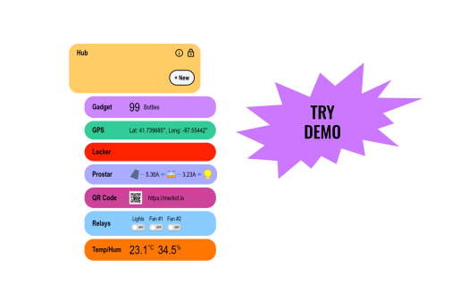
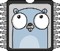

# MERLIOT
PRIVATE DEVICE HUB

<a href="https://merliot.io">Merliot</a> Hub is your private device hub, allowing you to monitor and control your devices over the Internet, privately.  Deploy your hub on the cloud or on your local server or Raspberry Pi. View your hub and devices from any web browser, even on your phone. There is no app to install.

## QUICK INSTALL

### &#x2B50; Install with Docker

<pre>
$ sudo docker run -p 8000:8000 merliot/hub
</pre>

Browse to `http://localhost:8000` to view hub.

See other [install](https://merliot.io/doc/install) methods.

### &#x2B50; Install on Cloud

Run a FREE hub instance on <a target="_blank" href="koyeb.com">Koyeb</a>.  Use the one-click button to get started:

See other cloud [install](https://merliot.io/doc/install) methods.

### &#x2B50; Run from Source

<pre>
$ git clone https://github.com/merliot/hub.git
$ cd hub
$ go run ./cmd
</pre>

Browse to http://localhost:8000 to view hub.

## CREDITS

Merliot is written in
	<a class="no-underline" href="https://go.dev/">Go</a>,
	<a class="no-underline" href="https://tinygo.org/">TinyGo</a>, and
	<a class="no-underline" href="https://htmx.org/">htmx.</a>
	Thank you to those who built and maintain these fine tools.

	
	
	

