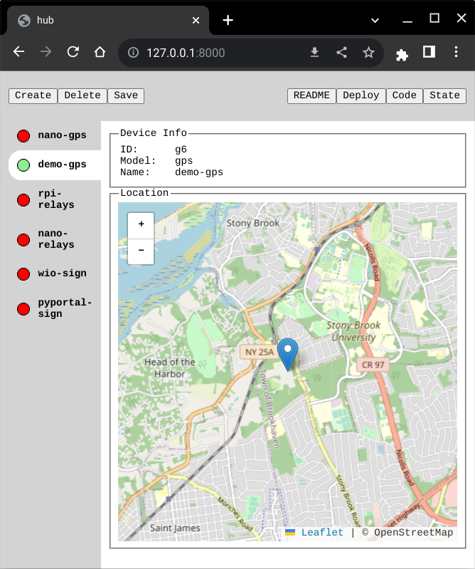

# Merliot Hub

[](https://pkg.go.dev/github.com/merliot/hub)
[](https://goreportcard.com/report/github.com/merliot/hub)

[](https://youtu.be/oHmQlU-gCKA)

Merliot Hub is a device hub, written in [Go](go.dev) and [TinyGo](tinygo.org).

## Quick Start

**Prerequisite**: Go version 1.20 or higher

```
git clone https://github.com/merliot/hub.git
cd hub
go run cmd/hub/main.go
```

Browse to [http://127.0.0.1:8000](http://127.0.0.1:8000) to view hub and deploy devices.

To create a demo GPS device, click the demo-gps device, and then the deploy button.



> [!NOTE]
> For this quick start mode, deploying to TinyGo devices will not work, currently.  A future TinyGo release will address this.  To deploy on TinyGo devices, use the Docker or Cloud Quick Starts below.

## Quick Start Docker

Deploy Merliot Hub using [docker](https://www.docker.com/):

```
git clone https://github.com/merliot/hub.git
cd hub
docker build -t hub -f Dockerfile .
docker run -p 80:8000 hub
```

Browse to [http://127.0.0.1](http://127.0.0.1) to view hub and deploy devices.

## Quick Start Cloud

One-click deploy a Merliot Hub on one of these cloud providers:

[](https://app.koyeb.com/deploy?type=git&repository=github.com/merliot/hub&branch=main&name=hub&builder=dockerfile&env[SCHEME]=https)

## Device

A device is a gadget you build.  The picture-equation for a device is:


A device comprises a platform, some I/O, and the software (firmware) that runs on the device.  In this picture, the Raspberry Pi is the platform, the I/O is the relay and flow meter.  The device control code is written in Go; the device view code is written in HTML/JS/CSS.

The device dials into the hub so you can monitor and control the device from the hub.  Multiple devices, of different types, can dial into the hub.

The device is also a local web server, so you can browse directly to the device's address, skipping the hub.

## Device Platforms

Merliot Hub supports devices created on these platforms:

- [Raspberry Pi 3/4](https://www.raspberrypi.com/)
- [Raspberry Pi Pico W](https://www.raspberrypi.com/documentation/microcontrollers/raspberry-pi-pico.html) (Coming soon!)
- [Arduino Nano Connect rp2040](https://docs.arduino.cc/hardware/nano-rp2040-connect)
- [Seeed Wio Terminal](https://www.seeedstudio.com/Wio-Terminal-p-4509.html)
- [Adafruit PyPortal](https://www.adafruit.com/product/4116)

## Saving Changes

Merliot Hub saves device changes back to the hub repo.  Device changes happen when you create, delete, or deploy a device.  You must [fork](https://docs.github.com/en/get-started/quickstart/fork-a-repo) this repo to save your changes.  Follow the Quick Start guides, but use your own fork when git cloning.

The hub need some git credentials to save changes back to the repo.  Pass the GIT_xxx environment vars (see below) to your hub instance.  If using a cloud provider, pass the GIT_xxx environment vars using the provider's secrets to store the GIT_xxx values.

## Environment Variables

These variables configure the hub and devices:

**SCHEME** (hub)

Scheme used for hub, either 'http' or 'https'.  Default is 'http'.

**PORT** (hub)

Port the hub listens on, default is 8000.

**PPROF_PORT (hub)

Port for golang pprof.  Setting PPROF_PORT=6060 will map /pprof/ to the runtime profiling data for the hub.  Browse to <hub address>/pprof/debug/pprof/.

**GIT_AUTHOR, GIT_REMOTE, GIT_KEY** (hub)

Required if saving device changes.

**BACKUP_HUB** (hub)

Run as a backup hub.  A backup hub cannot make changes or deploy devices, but does provide an alternate address for viewing the hub devices.

**USER, PASSWD** (hub + device)

Set user and password for HTTP Basic Authentication on the hub.  The user will be prompted for user/password when browsing to the hub.  These values (if set) are automatically passed down to the device when deployed, and the device connects to the hub using these creditials.

**WIFI_SSID, WIFI_PASSPHRASE** (device)

Set Wifi SSID and passphrase for Wifi-enabled devices built with TinyGo.  If mulitple SSID/passphrases are needed, use env vars WIFI_SSID_x and WIFI_SSID_PASSPHRASE_x, where x is 0-9.

## Hub Memory Requirements

Outside of deploying devices, the hub consumes little memory (or CPU) and can run on Linux machines with a minimum of 256M and 2G disk space.  Of course, a resource-hungry device may want more, but most are effectively idle.  To deploy devices, the hub needs more memory.  To deploy to targets built with Go, the minimum is 512M.  To deploy to targets build with TinyGo, the minimum is 2G RAM.

## Building New Devices

New devices can be built from scratch or by extending existing devices.  The new device is given a unique model name.
