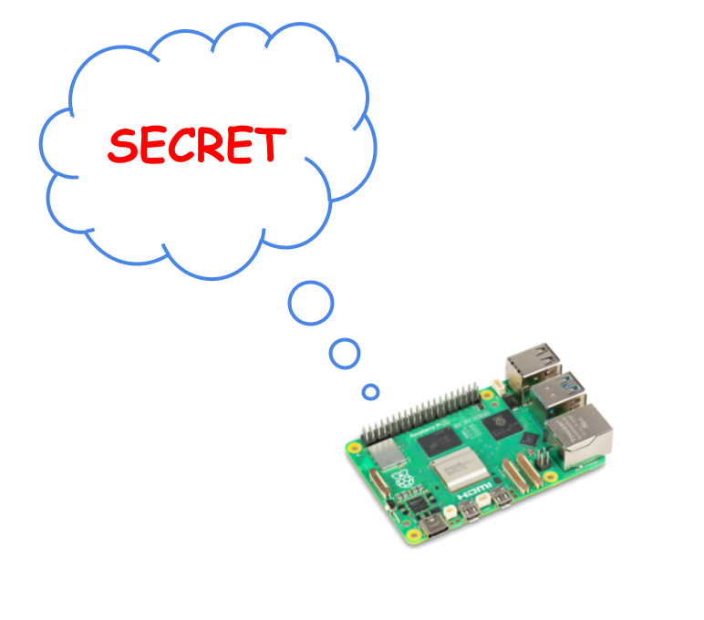

# MERLIOT DEVICE HUB

<a href="https://merliot.io">Merliot</a> Hub is an
AI-integrated device hub.

What does that mean?  It means you can control and interact with your physical
devices, your security camera, your thermometer, seamlessly using natural
language from an LLM host such as [Claude Desktop](https://claude.ai/download)
or [Cursor](https://cursor.com).  The hub is a gateway between AI and the
physical world.

What could go wrong?

### Devices

Which devices?  Not any of the retail Smart devices, sorry.  You build a device
from hobby-grade components which are readily available, like Raspberry Pis,
Arduinos, buttons, relays, and sensors.  You need maker-level skills to build
the devices.  The hub includes a parts list and instructions for building each
device.  There is no software to write; the hub includes the downloadable
device firmware.

## FEATURES

- ### Privacy

    - Merliot Hub uses a distributed architecture rather than a centralized
      architecture, eliminating third-party access to your devices' data. You
      install and maintain your own hub and devices.  No one else has access.  Your
      data is private.  Your data can't be sold, shared, stored, analyzed, or
      surveilled by third parties.  [Read more](https://www.merliot.io/doc/privacy).

- ### Web App

    - Merliot hub is a web app.  There is no phone app.  You can use any
      web browser on any device, including your phone, to access your hub,
      locally or over the internet.  Try the [demo](https://merliot.io/demo)
      to get a feel for the UI.

- ### AI-Integration

	- Merliot Hub is a Model Context Protocol ([MCP](https://www.merliot.io/doc/mcp-server))
      server.  The MCP server lets you plug your Merliot Hub into LLM hosts such as
      Claude or Cursor.  From there, you can chat with the hub using natural language:

		<pre>
		"List all of the devices in a tree view"
		"Add a new gps device"
		"Turn on all the relays"
		"Show the instructions on how to deploy a qrcode device"
		</pre>

- ### Cloud-Ready

    - Merliot Hub is packaged as a Docker image so you can run your hub
      anywhere you can run a Docker image, locally on your own laptop or server
      using Docker Desktop, or on the cloud.  See
      [install](https://merliot.io/doc/install) guide for more info.  The docker
      image requires a minimal VM: 0.1vCPU, 256MB RAM, 256MB disk.  Koyeb offers a
      [FREE](#install-on-cloud) VM suitable for running a hub in the cloud.

## SUPPORTED DEVICES TARGETS

Merliot Hub devices are built from one or more target platforms:

- [Raspberry Pi (models 3, 4, 5, and Zero 2W)](https://www.raspberrypi.com/)
- [Arduino Nano rp2040 Connect](https://store.arduino.cc/products/arduino-nano-rp2040-connect)
- [Adafruit PyPortal](https://www.adafruit.com/product/4116)
- [Koyeb (cloud)](https://koyeb.com)
- Linux x86-64

## QUICK START

See the official [Quick Start](https://merliot.io/doc/quick-start) and
[Install](https://merliot.io/doc/install) guides for more info.

### Install with Docker

<pre>
$ sudo docker run -p 8000:8000 merliot/hub
</pre>

Browse to `http://localhost:8000` to view hub.

### Install on Cloud

Run a FREE hub instance on [Koyeb](https://koyeb.com).  Use this one-click button to get started:

### Run from Source

<pre>
$ git clone https://github.com/merliot/hub.git
$ cd hub
$ go run ./cmd
</pre>

Browse to `http://localhost:8000` to view hub.

## CONTRIBUTING

PRs/Issues welcomed.

I'd like to see others build cool devices to share and to add to the project.

## TESTING

<pre>
$ go test ./test/...
</pre>

## LICENSE

BSD 3-Clause License

## CONTACT

Email: <a href="mailto:contact@merliot.io">contact@merliot.io</a>

X: [@merliotio](https://x.com/merliotio)

Slack: [#merliot](https://merliotcommunity.slack.com/messages/C06Q6QV6YSJ)

## CREDITS

Merliot is written in
	<a class="no-underline" href="https://go.dev/">Go</a>,
	<a class="no-underline" href="https://tinygo.org/">TinyGo</a>, and
	<a class="no-underline" href="https://htmx.org/">htmx.</a>
	Thank you to those who built and maintain these fine tools.

	
	
	

