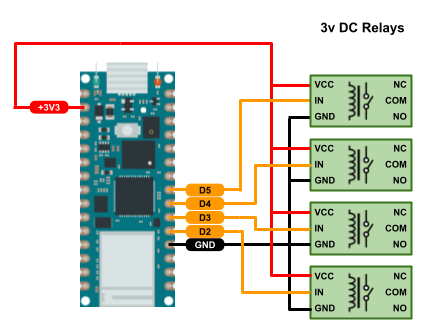
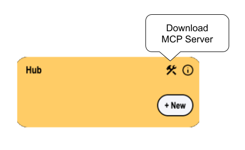

# MERLIOT
PRIVATE DEVICE HUB

## Introduction

<a target="_blank" href="https://merliot.io">Merliot</a> Hub is a private device hub, a web app, and an MCP server.

There is a lot to unpack there.  Let’s start with the private device hub
part.

### Private Hub

Consumer-grade Smart devices such as Smart security cameras, Smart lights,
and Smart thermostats have one thing in common: they dial home to the device
manufacturer's central hub.  For each manufacture, you'll install a phone app
which connects to the same central hub.  Your data is unencrypted on the
manufacture's side of the hub.  Your data is not private.  The device
manufacturer can analyze, track, store, share, and sell your data.  Your data
plus your profile associated with the device purchase and app signup make _you_
the product.

Merliot Hub is private.  It’s private by switching from a central-hub
architecture to a distributed-hub architecture.  There is no central Merliot
Hub.  Each user of Merliot Hub installs their own hub.  A hub can be installed
on a local resource such as a laptop or Raspberry Pi.  Alternatively, it can be
installed on the cloud (for free in some cases).  Each user’s hub is
independent from others’.  There is no central hub.  No central point to
compromise, tap, exploit, or profit from.

The trade off for privacy is convenience.  Not only do you have to <a
target="_blank" href="https://www.merliot.io/doc/quick-start">install</a> your
own Merliot Hub, you have to build your own devices.  Merliot Hub devices are
built from hobbyist-level components that are readily available.  There are
camera, gps, relay, timer and other devices you can build for the hub.
Assembling the devices requires maker-level skills.  There is no software to
write, unless you want to create a new device model.  (Fun fact: <a
target="_blank" href="https://www.merliot.io/blog/2025-5-4-third-blog">LLMs</a>
can also write new device models).

  

### Web App

Merliot Hub is a web app.  There is no phone app.  But, you can use any
browser on any device, including your phone, to access your hub, locally or
over the internet.  Try the demo to get a feel for the UI.

### MCP Server

Merliot Hub is a Model Context Protocol (<a target="_blank" src="doc/mcp-server">MCP</a>) server.  The MCP server lets
you plug your Merliot Hub into LLM hosts such as Claude or Cursor.  From there,
you can chat with the hub using natural language:

<pre>
"List all of the devices in a tree view"
"Add a new gps device"
"Turn on all the relays"
"Show the instructions on how to deploy a qrcode device"
</pre>

You can download a MCP server for a Merliot Hub by clicking the ‘tools’ icon.

## QUICK INSTALL

### &#x2B50; Install with Docker

<pre>
$ sudo docker run -p 8000:8000 merliot/hub
</pre>

Browse to `http://localhost:8000` to view hub.

See other [install](https://merliot.io/doc/install) methods.

### &#x2B50; Install on Cloud

Run a FREE hub instance on <a target="_blank" href="koyeb.com">Koyeb</a>.  Use the one-click button to get started:

See other cloud [install](https://merliot.io/doc/install) methods.

### &#x2B50; Run from Source

<pre>
$ git clone https://github.com/merliot/hub.git
$ cd hub
$ go run ./cmd
</pre>

Browse to http://localhost:8000 to view hub.

## CREDITS

Merliot is written in
	<a class="no-underline" href="https://go.dev/">Go</a>,
	<a class="no-underline" href="https://tinygo.org/">TinyGo</a>, and
	<a class="no-underline" href="https://htmx.org/">htmx.</a>
	Thank you to those who built and maintain these fine tools.

	
	
	

