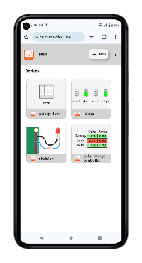
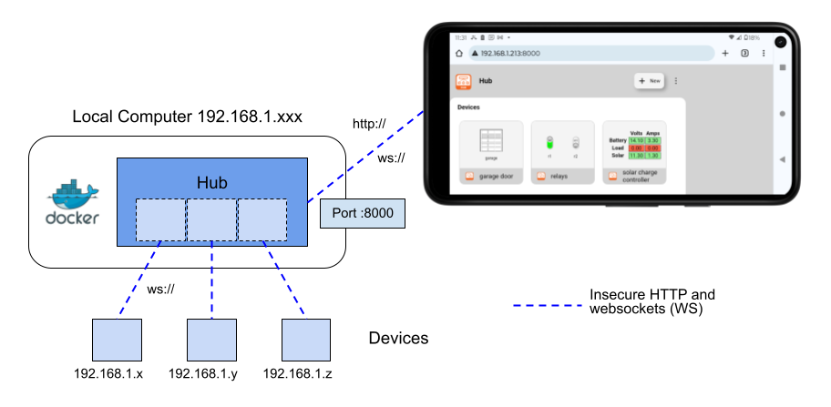
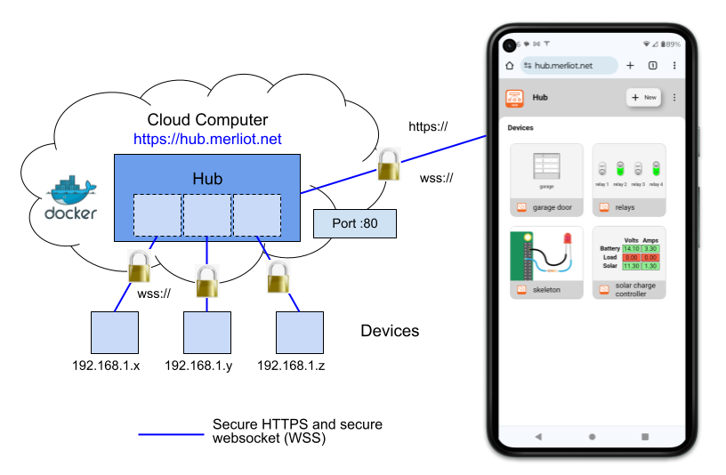
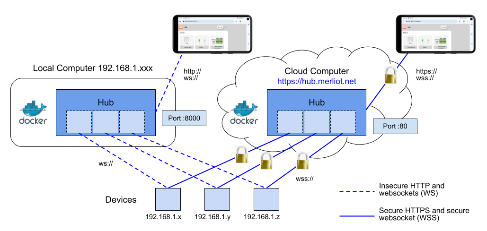
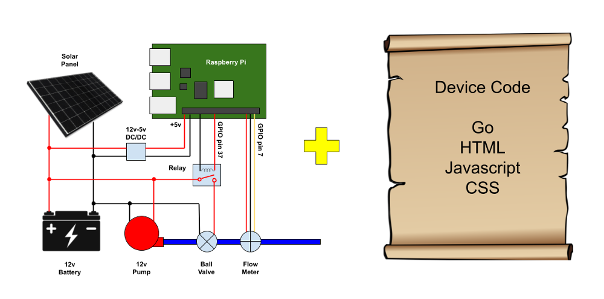

[](https://pkg.go.dev/github.com/merliot/hub)
[](https://goreportcard.com/report/github.com/merliot/hub)

## About

Merliot Hub is a private, non-centralized IoT device hub, written in [Go](go.dev) and [TinyGo](tinygo.org).

Securely access your devices from anywhere on the Internet.  Try it for [Free](#install-on-koyeb-for-free).  No app required.



With Merliot Hub, you own the hub.  You own the devices.  And most importantly, you own the data.  There is no third-party between your hub and your devices; your data is private.

Merliot Hub is non-centralized, meaning your hub is independent of your neighbor's hub, and there is no central control over any hub.

* [Install](#install)
  * [Install Locally](#install-locally)
  * [Install on Cloud](#install-on-cloud)
  * [Install Locally and on Cloud](#install-locally-and-on-cloud)
  * [Install from Source](#install-from-source)
* [Devices](#devices)
  * [Saving Devices](#saving-devices)
  * [Supported Targets](#supported-targets)
  * [Example Devices](#example-devices)
  * [Making a New Device](#making-a-new-device)
* [Environment Variables](#environment-variables)

## Install

Install Merliot Hub locally on your computer, on the cloud, or both, using our Docker image, without having to install all the dependencies.  (If you don't have [Docker](https://www.docker.com/), you can install the hub from [source](#install-from-source)).

### Install Locally

You can install Merliot Hub on a computer on your local network.  The devices will dial into the hub on your local network.  You access the hub at it's local IP address.



**Prerequisite**: Installed [Docker](https://docs.docker.com/get-docker/) environment.
  
```
docker pull merliot/hub
docker run -p 8000:8000 merliot/hub
```

Browse to http://\<host\>:8000 to view hub and deploy devices, where \<host\> is your IP address or hostname of your computer.

You can pass in [environment variables](#environment-variables).  For example, to set the Wifi SSID/Passphrase to be programmed into the devices:

```
docker run -e WIFI_SSIDS="My SSID" -e WIFI_PASSPHRASES="mypassphrase" -p 8000:8000 merliot/hub
```

Or to protect your hub with a user/password:

```
docker run -e USER="xxx" -e PASSWD="yyy" -p 8000:8000 merliot/hub
```

### Install on Cloud

You can install Merliot Hub on the Internet using a cloud providers such as [Koyeb](https://www.koyeb.com), [Digital Ocean](https://www.digitalocean.com/), and [GCP](https://cloud.google.com) (Google Cloud Platform), to name a few.  The docker image path is:

```
docker pull merliot/hub
```



#### Environment Variables

:white_check_mark: $PORT=8000.  The hub listens on port :8000.

:white_check_mark: $WS_SCHEME=wss://.  This uses the secure websocket scheme to connect to the hub.

(See additional [environment variables](#environment-variables)).

#### Install on Koyeb for Free

Click the button to install Merliot Hub on Koyeb, for Free!  A Koyeb account is required.

[](https://app.koyeb.com/deploy?type=docker&image=merliot/hub&name=hub&env[WS_SCHEME]=wss://)

All cloud providers require an account, there's no getting around that.  Some have free-tiers or introductory credits to get started.  [Koyeb](https://www.koyeb.com) offers a free virtual machine with more than enough resources to run a hub.

Review the settings for the virtual machine (VM) and click Apply.  It takes a few minutes for the VM to start.  Your new hub will have an Internet URL in the format:

https://hub-ACCOUNT.koyeb.app/

Where ACCOUNT is your Koyeb account name.

If you own a domain name, you can map it to the hub URL.

### Install Locally and on Cloud



### Install from Source

**Prerequisites**:
* [Go](https://go.dev/doc/install) version 1.22 or higher
* [TinyGo](https://tinygo.org/getting-started/install/) version 0.31.1 or higher.

```
git clone https://github.com/merliot/hub.git
cd hub
go run ./cmd
```

Browse to http://\<host\> to view hub and deploy devices, where \<host\> is your IP address or hostname of your computer.

## Devices

A device is a gadget you build.  The picture-equation for a device is:



A device comprises a platform, some I/O, and the software (firmware) that runs on the device.  In this picture, the Raspberry Pi is the platform, the I/O is the relay and flow meter.  The device control code is written in Go; the device view code is written in HTML/JS/CSS.

The device dials into the hub so you can monitor and control the device from the hub.  Multiple devices, of different types, can dial into the hub.

The device is also a local web server, so you can browse directly to the device's address, skipping the hub.

### Saving Devices

### Supported Targets

Merliot Hub supports devices created on these platforms:

- [Raspberry Pi 3/4/5/Zero W/Zero 2 W](https://www.raspberrypi.com/)
- [Arduino Nano Connect rp2040](https://docs.arduino.cc/hardware/nano-rp2040-connect)
- [Seeed Wio Terminal](https://www.seeedstudio.com/Wio-Terminal-p-4509.html)
- [Adafruit PyPortal](https://www.adafruit.com/product/4116)

### Example Devices

- [Skeleton Device](https://github.com/merliot/skeleton) (template for new devices)
- [Device Hub](https://github.com/merliot/hub) (a hub is a device also)
- [Relay Controller](https://github.com/merliot/relays)
- [Garage Door Opener](https://github.com/merliot/garage)
- [MorningStar Solar Charge Controller](https://github.com/merliot/ps30m) (Modbus)

### Making a New Device

## Environment Variables

These variables configure the hub and devices:

**DEVICES**

Hub devices.  This is a JSON-formatted list of devices.  The format is:

```
{
	"<id>": {
		"Model": "<model>",
		"Name": "<name>",
		"DeployParams": "<deploy params>"
	},
}
```

Example with two devices:

```
{
	"6bb645c9-db12e9c9": {
		"Model": "skeleton",
		"Name": "example",
		"DeployParams": "target=demo\u0026gpio-default=on"
	},
	"6bccaffd-6d8fab72": {
		"Model": "garage",
		"Name": "garage",
		"DeployParams": "target=demo\u0026door=garage+door\u0026relay=DEMO0"
	},
}
```

**PORT**

Port the hub listens on, default is `PORT=8000`.

**WS_SCHEME**

Websocket scheme to use for dialing back into the hub.  Default is `WS_SCHEME=ws://`.  If the hub is running under https://, then set `WS_SCHEME=wss://`.

**USER, PASSWD**

Set user and password for HTTP Basic Authentication on the hub.  The user will be prompted for user/password when browsing to the hub.  These values (if set) are automatically passed down to the device when deployed, and the device connects to the hub using these creditials.  For example:

- `USER=foo`
- `PASSWD=bar`

**WIFI_SSIDS, WIFI_PASSPHRASES**

Set Wifi SSID(s) and passphrase(s) for Wifi-enabled devices built with TinyGo.  These are matched comma-delimited lists.  For each SSID, there should be a matching passphrase.  For example:

- `WIFI_SSIDS="test,backup"`
- `PASSPHRASES="testtest,backdown"`

So testtest goes with SSID test, and backdown goes with SSID backup.

**DIAL_URLS**

By default, the each device will dial into the hub that created the device.  To additionally dial into another hub, set `DIAL_URLS` to the other hub address.  

For example, a primary hub is at local address http://192.168.1.10.  Any device created on the primary hub will dial into the primary hub's address.  A secondary hub is at cloud address https://hub.merliot.net.  Set `DIAL_URLS=https://hub.merliot.net` on the primary hub.  Now the devices will dial into both hubs.  `DIAL_URLS` can take a comma-separated list of URLs.

## Hub Memory Requirements

The hub consumes little memory (or CPU) and can run on a Linux machine (or virtual machine) with a minimum of 256M and 2G disk space.
