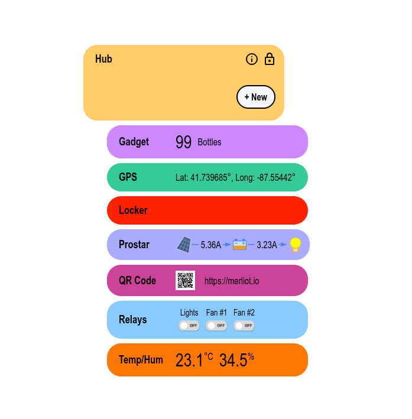

# Merliot
Private Device Hub

## Run from Docker

<pre>
$ sudo docker run -p 8000:8000 merliot/hub
</pre>

Browse to `http://localhost:8000` to view hub.

See other [install](https://merliot.io/doc/install) methods.

## Run from Source

<pre>
$ git clone https://github.com/merliot/hub.git
$ cd hub
$ go run ./cmd
</pre>
