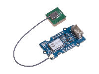
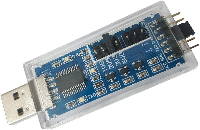

## GPS Device

Reports a GPS location in lat/long and shows the location on a map.


Uses [Grove GPS (Air530)](https://www.seeedstudio.com/Grove-GPS-Air530-p-4584.html) from Seeed Studio.  The GPS module periodically sends NMEA messages over serial.



### Battery

Use a CR1220 battery in the GPS module to decrease start-up time from power-on to first valid GPS report.  Without the battery, after power-on, it can take 10+ minutes to lock onto GPS.  With the battery, it will take a few seconds.

### Wiring

#### Linux x86-64

Connect the Air530 GPS module to a USB-to-UART dongle, such as:



Air530  | USB-UART
------- | ---------
Vcc | Vcc
Gnd | Gnd
Tx | Rx
Rx | Tx

Plug the dongle into a USB port on a Linux system.  You can verify the GPS module output using minicom.  The device is /dev/ttyUSB0, 9600 baud:

```bash
sudo minicom -D /dev/ttyUSB0 -b 9600
```

Proceed with the install instructions.

#### Raspberry Pi

You can use a USB-UART dongle as above for Linux and the wiring is the same.

Connecting the Air530 directly to the Raspberry Pi UART...(TODO finish this)

#### Arduino Nano Connect (rp2040)

Connect the Air530 to the Arduino Nano Connect:

Air530  | Nano Connect
------- | -------------
Vcc | +3v3
Gnd | Gnd
Tx | Rx (GPIO1)
Rx | Tx (GPIO0)

Proceed with the install instructions.
