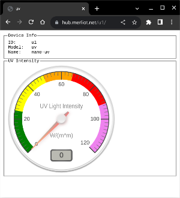
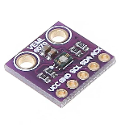

## UV Light Intensity Device

Show the UV light intensity using a VEML6070 digital UV light sensor by Vishay.

### Wiring

#### Arduino Nano Connect RP2040

VEML6070 | Nano Connect
-------- | ------------
Vcc      | +3V3
Gnd      | Gnd
SCL      | SCL (GPIO13)
SCA      | SCA (GPIO12)
