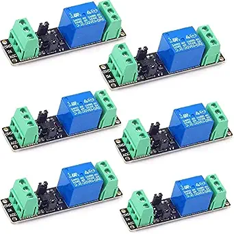
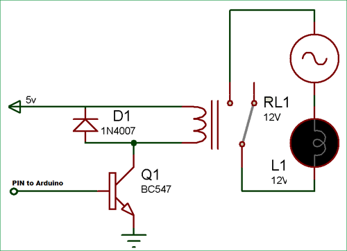

## Relays Device

Relays let's you control up to 4 GPIO-connected relays.

### Wiring

You can use a relay hat/module connected to the Arduino or Rapsberry Pi.

 

Or you can use a transistor circuit directly:

Connect the relay VCC, GND, and inputs to GPIO pins on the Arduino/Raspberry Pi.
